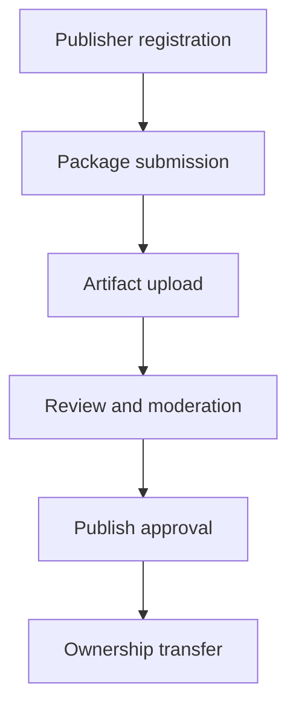

# CoreHub Publishing Roadmap

CoreHub publishing is planned as a controlled registry workflow. The current registry is read-only: users can browse, search, inspect publishers, inspect versions, inspect artifacts, and use signed download redirects, but remote package publishing is not open yet.

## Current Boundary

| Surface | Status |
| --- | --- |
| Catalog browsing | Live now |
| Search | Live now |
| Publisher identity | Live now |
| Publisher-owned versions | Live now |
| Artifact manifests | Live now |
| Storage-backed signed downloads | Live now |
| Dry-run install planning | Live now |
| OpenClaw-style CoreBlow install command | Live now, installs verified CoreHub plugin archives by default |
| CoreBlow plugin installer boundary | Live now for CoreHub plugin archives |
| Remote publish writes | Planned |
| Artifact upload API | Planned |
| Review and moderation queue | Planned |
| Ownership transfer | Planned |
| Install analytics | Planned |

## Planned Publishing Flow

## Publisher Registration

Publisher registration will bind a stable CoreHub handle to a person, organization, or repository owner. The publisher record already exists in the catalog shape, but self-service registration is not open yet.

Planned checks:

| Check | Purpose |
| --- | --- |
| Handle ownership | Prevent package ownership ambiguity. |
| Public profile URL | Give users and reviewers a source of accountability. |
| Contact URL | Provide a support or security reporting path. |
| Verification state | Mark publishers that CoreHub recognizes as trusted. |

## Package Submission

Package submission will create or update catalog entries for skills, plugins, providers, and channel integrations. Submissions should be metadata-first so review can happen before artifacts are accepted for install.

Required submission metadata will include:

- package id
- kind
- name and summary
- source repository
- publisher handle
- compatibility metadata
- review notes when required

## Artifact Upload

Artifact upload will attach a versioned artifact to an approved package. The current artifact manifest shape already describes the expected metadata: name, media type, size, checksum, storage locator, provenance, and file list.

Planned upload rules:

| Rule | Reason |
| --- | --- |
| Checksum required | Clients must verify downloaded bytes. |
| Size required | Clients must detect truncated or swapped artifacts. |
| Storage locator required | CoreHub must know where redirects point. |
| Provenance required | Reviewers must trace artifacts back to source. |
| Download policy required | CoreHub must be able to disable unsafe artifacts. |

## Review and Moderation

Review and moderation will decide whether a submitted package or version can become installable. The version status values already model this boundary.

| Status | Meaning |
| --- | --- |
| `metadata-only` | Visible as metadata, not installable. |
| `available` | Eligible for signed download redirects. |
| `deprecated` | Kept for compatibility or rollback context, not recommended for new installs. |
| `blocked` | Blocked by policy or security review. |

## Publish Approval

Publish approval will move a package version from review into an installable state. Approval should update version status, artifact download policy, review metadata, and signed redirect eligibility together.

Publish approval should not silently change:

- package owner
- artifact checksum
- storage key
- source repository
- version string

Those fields define the trust contract clients inspect before install.

## Ownership Transfer

Ownership transfer is planned, but it must be explicit and auditable. A transfer should not rewrite existing trust history or make older installs trust a new publisher without visible metadata.

Planned transfer behavior:

| Transfer case | Expected behavior |
| --- | --- |
| New package ownership | Future versions use the new publisher. |
| Existing versions | Preserve original publisher metadata. |
| Disputed package | Freeze publishing until moderation resolves it. |
| Deprecated owner | Keep audit history visible. |

## Intentionally Blocked

Some operations stay blocked until the write-side registry is ready:

| Operation | Why it stays blocked |
| --- | --- |
| Anonymous package publishing | Publisher identity must exist first. |
| Unsigned download redirects | Clients need an auditable download contract. |
| Artifact without checksum | Install clients cannot verify bytes. |
| Artifact without storage locator | CoreHub cannot explain where bytes came from. |
| Ownership transfer without audit trail | Existing trust decisions would become ambiguous. |

## Roadmap Order

The recommended implementation order is:

1. Verified CLI download with checksum and size enforcement. Done.
2. Dry-run install planning that wires verified downloads into install intent. Done.
3. OpenClaw-style `corehub install <id>` command with `--dry-run` preview. Done.
4. Installable CoreBlow plugin archive artifacts. Done for `plugin-lab`.
5. CoreBlow `plugins install corehub:<id>` installer boundary. Done.
6. Publisher registration model.
7. Package submission draft API.
8. Artifact upload and storage policy.
9. Review and moderation queue.
10. Publish approval flow.
11. Ownership transfer workflow.
12. Aggregate install analytics.

This keeps the CoreHub trust chain intact while moving from read-only registry data toward controlled publisher writes.
