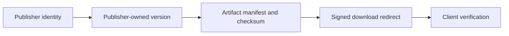

# CoreHub Trust Model

CoreHub trust starts with publisher identity and ends with client-side artifact verification. The registry is designed so package discovery, version ownership, artifact metadata, and signed downloads can be audited before anything is installed.

## Trust Flow



## Publisher Identity

Each catalog entry can include a publisher record with a stable handle, display name, public URL, verification state, and contact URL. CoreHub uses the publisher handle as the ownership anchor for package records and version metadata.

Publisher identity answers:

| Question | CoreHub field |
| --- | --- |
| Who owns this entry | `publisher.handle` |
| Is the publisher recognized by CoreHub | `publisher.verified` |
| Where can reviewers inspect the publisher | `publisher.url` |
| Where can users report issues | `publisher.contact` |

## Version Ownership

Package versions carry their own publisher handle. The version publisher must match the catalog entry publisher, so ownership stays explicit at release time instead of being inferred only from the package id.

CoreHub validates:

- version strings use semver format
- version status is one of `metadata-only`, `available`, `deprecated`, or `blocked`
- version publisher handle matches the entry publisher handle
- every available version points at an artifact manifest

## Artifact Checksum

Artifact manifests include byte size and SHA-256 checksum metadata. Clients should treat those fields as required install gates.

| Field | Client check |
| --- | --- |
| `artifact.size` | Downloaded byte count must match. |
| `artifact.sha256` | Downloaded content hash must match. |
| `artifact.files` | File list must match expected manifest content when present. |
| `artifact.provenance.source` | Source repository must match the package record. |

The CoreHub CLI enforces the size and SHA-256 checks when `corehub package download <id> --output <path>` is used. If either check fails, the command stops before writing the artifact.

## Storage Locator

The artifact `storage` block separates registry trust metadata from the physical storage provider. CoreHub can point at GitHub raw storage today and add R2 or S3-compatible storage without changing the package API shape.

```json
{
  "storage": {
    "provider": "github-raw",
    "key": "artifacts/plugin-lab-0.1.0.corehub-manifest.json",
    "url": "https://raw.githubusercontent.com/coreblow/corehub/main/artifacts/plugin-lab-0.1.0.corehub-manifest.json"
  }
}
```

The storage key is part of the signed download contract, so a client can detect if a redirect no longer points at the artifact it inspected.

## Signed Redirect

The download endpoint resolves package, version, publisher, artifact, and storage metadata before returning a redirect. By default, CoreHub returns `302` to the storage URL. CLI clients can request `redirect=false` to inspect the signed contract as JSON.

The signature covers:

- package id
- version
- artifact checksum
- storage key
- expiry timestamp

The response also exposes headers for audit tooling:

| Header | Purpose |
| --- | --- |
| `X-CoreHub-Package` | Package id selected by the registry. |
| `X-CoreHub-Version` | Resolved version. |
| `X-CoreHub-Artifact-Sha256` | Expected checksum. |
| `X-CoreHub-Download-Expires` | Contract expiry timestamp. |
| `X-CoreHub-Download-Signature` | Signature over the download contract. |

## Moderation Status

CoreHub uses version status and review metadata to keep moderation decisions visible. The current registry is read-only, but the same fields are the enforcement hooks for future publisher write flows.

| Status | Download behavior |
| --- | --- |
| `metadata-only` | Visible in metadata, but not eligible for redirect. |
| `available` | Eligible for signed redirect when `artifact.downloadEnabled` is `true` and storage metadata exists. |
| `deprecated` | Visible for compatibility, but should not be selected for new installs. |
| `blocked` | Blocked by policy or security review. |

## Blocked and Deprecated Behavior

Clients should fail closed when CoreHub reports a non-available version, a missing storage locator, a disabled download policy, or a checksum mismatch. Deprecated versions can remain discoverable for audit and rollback context, while blocked versions should not be installed.

Recommended client behavior:

| Condition | Client action |
| --- | --- |
| Version status is `blocked` | Stop install and show the moderation status. |
| Version status is `deprecated` | Warn and require explicit operator choice. |
| `artifact.downloadEnabled` is `false` | Do not fetch storage. |
| Storage URL is missing | Treat the package as not installable. |
| Size or checksum mismatch | Delete the downloaded artifact and fail. |

## Security Boundary

CoreHub does not ask clients to trust storage alone. The registry provides the signed contract, artifact metadata, publisher ownership, and moderation state. Storage only provides bytes; the client still verifies those bytes against CoreHub metadata before install.

For the planned write-side registry flow, see the [Publishing Roadmap](/corehub/publishing-roadmap).
